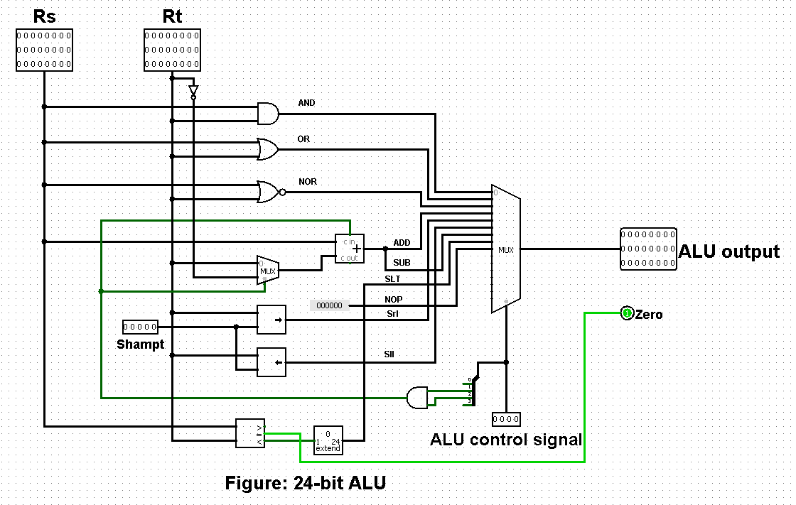
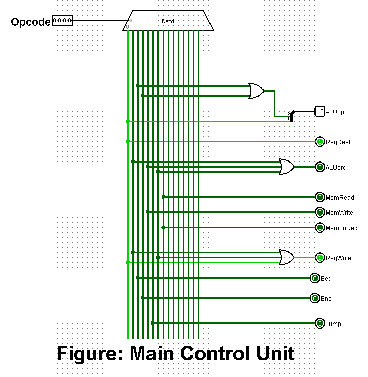
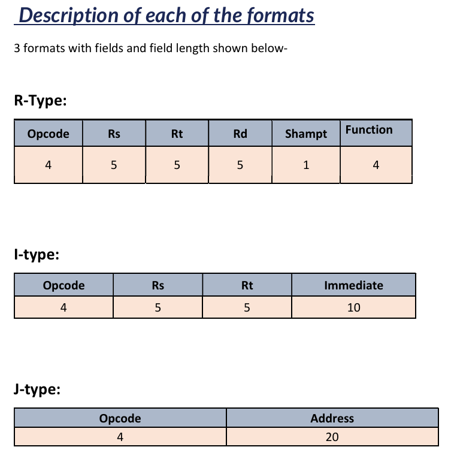

# 24-bit MIPS CPU (Logisim) with Python Assembler

A **24-bit MIPS-like CPU** designed and implemented in **Logisim** for  
**CSE332 — Computer Organization and Architecture (Summer 2024)**.

This repository includes:
- A complete **single-cycle 24-bit CPU** (Logisim circuit)
- A custom **24-bit ISA** with R/I/J formats
- Datapath + Control units + Register file + Memory support
- A **Python assembler** to generate Logisim-compatible machine code / ROM content

---

## Features
- 24-bit instruction width
- R-type, I-type, and J-type instruction formats
- 15 supported instructions
- Modular datapath design
- Separate **Main Control Unit** and **ALU Control Unit**
- Python assembler for easier testing

---

## Supported Instructions

**Arithmetic**
- ADD
- SUB
- ADDi

**Logical**
- AND
- OR
- NOR

**Shift & Compare**
- SLL
- SRL
- SLT

**Memory**
- LW
- SW

**Control Flow**
- BEQ
- BNE
- JMP

**Other**
- NOP

---

## Instruction Formats (24-bit)

**R-Type:** `Opcode(4) | Rs(5) | Rt(5) | Rd(5) | Shamt(1) | Funct(4)`  
**I-Type:** `Opcode(4) | Rs(5) | Rt(5) | Immediate(10)`  
**J-Type:** `Opcode(4) | Address(20)`

---

## Screenshots

Put your screenshots in `assets/images/` and keep the filenames the same as below.

### CPU Datapath

### ALU

### Main Control Unit

### ALU Control Unit

### Register File

### Instruction Set (optional)

---

## How to Run (Logisim)

1. Install **Logisim 2.7.1** (or Logisim Evolution).
2. Open the CPU circuit:
   - `cpu/24-bit-mips-cpu.circ`
3. Load a program into Instruction Memory / ROM (depends on your circuit):
   - Right-click the ROM / Instruction Memory component
   - Choose **Load Image...**
   - Select the output file generated by the assembler
4. Run the simulation:
   - Enable the clock / tick the clock and observe registers/memory.

---

## Using the Python Assembler

The assembler converts assembly instructions into machine code output usable in Logisim.

Run (from repo root):

    cd assembler
    python assembler.py

Folders:
- Inputs: `assembler/inputs/`
- Outputs: `assembler/outputs/`

Example assembly:

    addi $r3 $r0 7
    addi $r5 $r0 5
    add  $r7 $r3 $r5

---

## Repository Structure

    .
    ├── cpu/
    │   └── 24-bit-mips-cpu.circ
    ├── assembler/
    │   ├── assembler.py
    │   ├── inputs/
    │   └── outputs/
    ├── examples/
    │   ├── assembly-codes.txt
    │   └── assembly-code-format.txt
    ├── assets/
    │   └── images/
    └── docs/
        └── Project-Report.pdf

---

## Project Report
Full design details, tables, and diagrams:

- `docs/Project-Report.pdf`

---

## Authors
- Samir Mahmud
- Mohaimen Al Mamun

---

## Academic Integrity
This project is shared for learning/reference purposes only.  
Please do not submit this work as your own in any course.
